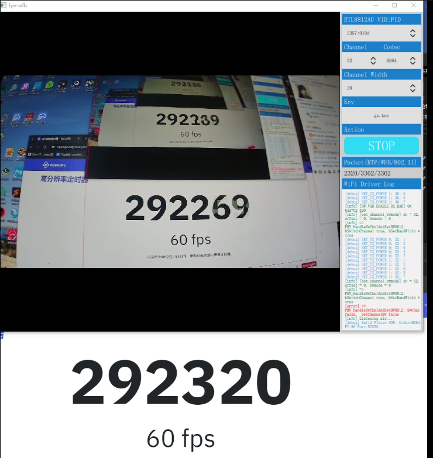

# WiFi Broadcast FPV client for Windows platform.

fpv4win is an app for Windows that packages multiple components together to decode an H264/H265 video feed broadcasted by wfb-ng over the air.

- [devourer](https://github.com/openipc/devourer): A userspace rtl8812au driver initially created by [buldo](https://github.com/buldo) and converted to C by [josephnef](https://github.com/josephnef) .
- [wfb-ng](https://github.com/svpcom/wfb-ng): A library that allows broadcasting the video feed over the air.

Supported rtl8812au WiFi adapter only.

It is recommended to use with [OpenIPC](https://github.com/OpenIPC) FPV

### Usage
- 1. Download [Zadig](https://github.com/pbatard/libwdi/releases/download/v1.5.0/zadig-2.8.exe)
- 2. Repair the libusb driver (you may need to enable [Options] -> [List All Devices] to show your adapter).

    

- 3. Install [vcredist_x64.exe](https://aka.ms/vs/17/release/vc_redist.x64.exe)
- 4. Select your 8812au adapter.
- 5. Select your WFB key.
- 6. Select your drone channel.
- 7. Enjoy!

### Delay test

### Todo
- OSD
- Hardware acceleration decoding
- Record MP4 file
- Capture frame to JPG
- Stream to RTMP/RTSP/SRT/WHIP server
- Receive multiple video streams using a single adapter
- ONVIF/GB28181/SIP client

### How to build
- Take a look at
[GithubAction](https://github.com/openipc/fpv4win/blob/main/.github/workflows/msbuild.yml)
