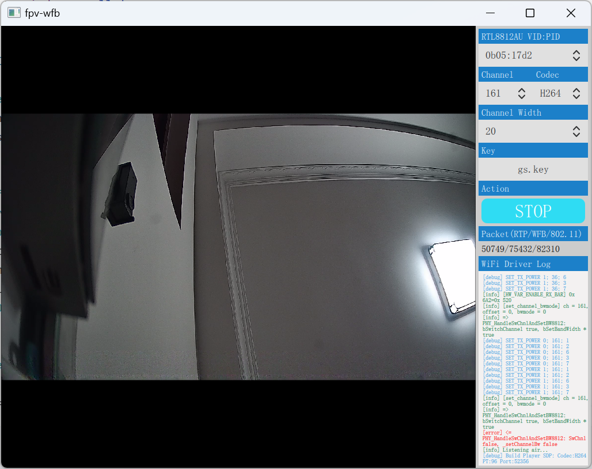
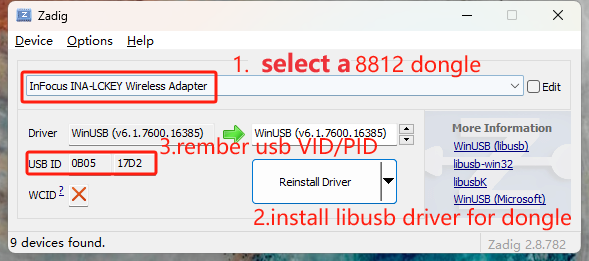

# WiFi Broadcast FPV client for Windows platform.
- RTL8812AU

fpv-wfb is an app for windows packaging multiple pieces together to decode an H264/H265 video feed broadcast by wfb-ng over the air.

- [devourer](https://github.com/openipc/devourer): userspace rtl8812au driver initially created by [buldo](https://github.com/buldo) and converted to C by [josephnef](https://github.com/josephnef) .
- [wfb-ng](https://github.com/svpcom/wfb-ng): library allowing the broadcast of the video feed over the air.
 
Supported rtl8812au wifi adapter only 

### Usage
- download [Zadig](https://github.com/pbatard/libwdi/releases/download/v1.5.0/zadig-2.8.exe)
- Repair libusb driver

- select you 8812au adapter
- select your wfb key
- select your drone channel
- enjoy

### How to build
- take a look for 
[GithubAction](https://github.com/TalusL/fpv-wfb/blob/main/.github/workflows/msbuild.yml)
